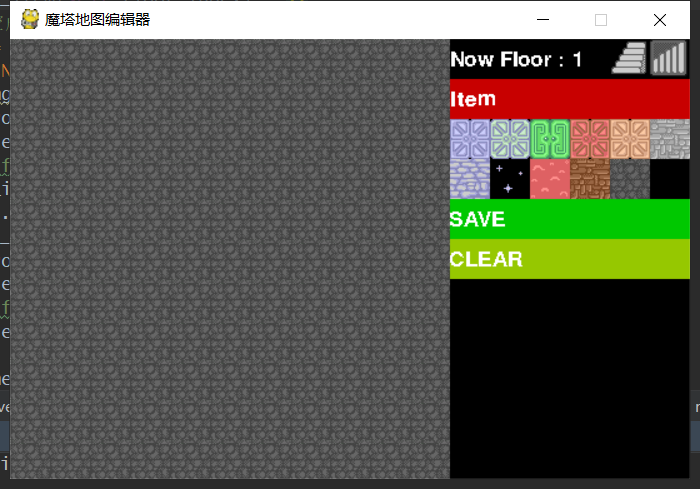

# 使用强化学习玩魔塔

## 2019-12-27:

​	游戏里所有可交互的item都是继承于OBJ这个类.OBJ定义了所有可交互东西的一些共有属性和方法

​	

| attribution |      |
| :---------: | ---- |
|    name     |      |
|    type     |      |
|             |      |

## 2019-09-26:

制作了一个地图编辑器(map_editor.py),用于方便的编辑地图.

点击 save 后 地图里面的元素 会保存到 floor/下

实例一个 GUI()后 按顺序 使用 GUI().addfloor()读入即可.参数是保存的文件使用json解析后的结果.类型为list

